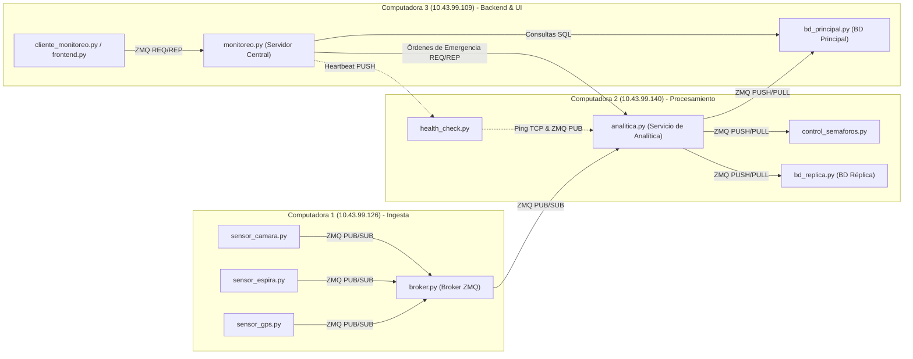

# Gestión Inteligente de Tráfico Urbano

Sistema distribuido para monitoreo, análisis y control del tráfico en tiempo real.
Arquitectura de 3 nodos con comunicación ZeroMQ, persistencia SQLite y failover automático.

| | |
|---|---|
| **Equipo** | Ricardo Hurtado Forero · Jose Manuel Guerrero López · Samuel Enrique Sabogal Giraldo |
| **Curso** | Introducción a Sistemas Distribuidos — Pontificia Universidad Javeriana |
| **Año** | 2026 |

---

## 🧩 Arquitectura del sistema



### Patrones ZeroMQ usados

| Patrón | Dónde | Para qué |
|--------|-------|----------|
| PUB/SUB  | Sensores → Broker | Eventos de tráfico |
| PUB/SUB | Broker → Analítica | Distribución de eventos |
| PUSH/PULL | Analítica → BD principal / réplica | Persistencia |
| PUSH/PULL | Analítica → Control semáforos | Comandos de semáforo |
| PUB/SUB | Health Check → Analítica | Notificación de failover |
| REQ/REP | Cliente → Monitoreo | Consultas manuales |

---

## Nodos

### PC1 — Sensores y Broker (`10.43.99.126`)

- **`sensor_camara.py`** — publica cada 2s: volumen de vehículos y velocidad promedio. Simula 3 perfiles (normal 60%, congestión 25%, hora pico 15%).
- **`sensor_espira.py`** — cuenta vehículos en ventanas de 30s, calcula tasa veh/s.
- **`sensor_gps.py`** — reporta velocidad promedio e infiere nivel de congestión (bajo/medio/alto).
- **`broker.py`** — recibe los 3 sensores por PULL, inyecta el campo `tipo` y reenvía por PUB.

### PC2 — Analítica y Control (`10.43.99.140`)

- **`analitica.py`** — clasifica eventos, genera comandos de semáforo y persiste en ambas BDs. Implementa **failover automático**: si PC3 cae, redirige la persistencia a la réplica; cuando PC3 regresa, la restaura.
- **`control_semaforos.py`** — aplica comandos VERDE/ROJO recibidos de analítica.
- **`bd_replica.py`** — réplica SQLite de respaldo; siempre activa.
- **`health_check.py`** — chequea TCP a PC3 cada 10s. Publica `PC3_UP` / `PC3_DOWN` via ZMQ PUB.

### PC3 — Base de Datos y Frontend (`10.43.99.109`)

- **`bd_principal.py`** — BD SQLite principal. Expone socket REP de sincronización para reconstruir estado tras una caída.
- **`monitoreo.py`** — atiende consultas REQ/REP (`consultar <INTER>`, `historico <INTER> [N]`). Envía heartbeat a PC2.
- **`frontend.py`** — servidor HTTP (stdlib pura). Dashboard en `http://10.43.99.109:8080/` con actualización automática cada 3s y control manual de semáforos.

---

## Tolerancia a fallos

Si **PC3 cae**:
1. `health_check` detecta la caída (máx. 10s + 3 reintentos).
2. Publica `PC3_DOWN` por ZMQ PUB.
3. `analitica` recibe la notificación y deja de enviar a BD principal.
4. Toda la persistencia va a `bd_replica` en PC2.
5. PC1 y PC2 siguen operando sin interrupción.

Cuando **PC3 regresa**:
1. `health_check` detecta que TCP responde.
2. Publica `PC3_UP`.
3. `analitica` reactiva el envío a BD principal.
4. El sistema queda sincronizado desde ese punto.

---

## Reglas de tráfico

| Clasificación | Condición (cámara) | Acción semáforo |
|---------------|---------------------|-----------------|
| `trafico_normal` | vol < 28 Y vel ≥ 22 km/h | ROJO 30s (ciclo estándar) |
| `congestion` | vol ≥ 28 O vel < 22 km/h | VERDE 45s (extender paso) |
| `priorizacion` | GPS nivel=alto O vel < 12 km/h | VERDE 55s (prioridad máxima) |

---

## Estructura del proyecto

```
trafico_urbano/
├── config.json              # Configuración centralizada (hosts, puertos)
├── common/
│   ├── config_loader.py     # Carga y valida config.json
│   ├── db.py                # Operaciones SQLite compartidas
│   ├── models.py            # Dataclasses: EventoCamara, EventoEspira, EventoGPS, ComandoSemaforo
│   └── utils.py             # Timestamps, logs, generador de intersecciones
├── pc1/
│   ├── broker.py
│   ├── sensor_camara.py
│   ├── sensor_espira.py
│   └── sensor_gps.py
├── pc2/
│   ├── analitica.py         # ← failover automático
│   ├── bd_replica.py
│   ├── control_semaforos.py
│   └── health_check.py      # ← publica PC3_UP / PC3_DOWN
└── pc3/
    ├── bd_principal.py      # ← socket de sincronización
    ├── frontend.py          # ← dashboard web :8080
    ├── monitoreo.py
    └── cliente_monitoreo.py
```

---

## Ejecución

### Requisitos
```bash
sudo apt update
sudo apt install python3-venv

# Crear entorno virtual
python3 -m venv .venv

# Activar entorno virtual
source .venv/bin/activate

# Instalar dependencias
python3 -m pip install "pyzmq>=26.0.0,<27.0.0"
```

- Red local con los puertos 5555–5561 y 8080 abiertos

### Paso 1 — Clonar el repositorio en los 3 PCs

```bash
git clone https://github.com/RicardoHurtadoF/Gestion-Inteligente-de-Trafico-Urbano traficoUrbano
cd traficoUrbano
```

### Paso 2 — Arrancar en orden

Abrir una terminal en cada PC y ejecutar su script. **El orden importa**: PC3 y PC2 deben estar listos antes de que PC1 empiece a generar eventos.

**Terminal en PC3** (`10.43.99.109`):
```bash
bash scripts/start_pc3.sh
```

**Terminal en PC2** (`10.43.99.140`):
```bash
bash scripts/start_pc2.sh
```

**Terminal en PC1** (`10.43.99.126`):
```bash
bash scripts/start_pc1.sh
```

### Paso 3 — Abrir el dashboard

```
http://10.43.99.109:8080/
```

El dashboard se actualiza automáticamente cada 3 segundos.

### Limpiar bases de datos (demo desde cero)

```bash
bash scripts/clean_db.sh
```

---

## Configuración

Toda la configuración de red está en `config.json`. Para cambiar las IPs solo hay que editar ese archivo — sin tocar el código fuente.

```json
{
  "pc1": { "host": "10.43.99.126" },
  "pc2": { "host": "10.43.99.140" },
  "pc3": { "host": "10.43.99.109", "frontend_port": 8080 },
  "ports": {
    "sensor_to_broker":        5555,
    "broker_to_analitica":     5556,
    "analitica_to_db_principal": 5557,
    "analitica_to_db_replica": 5558,
    "analitica_to_semaforos":  5559,
    "monitoreo_to_analitica":  5560,
    "healthcheck":             5561
  }
}
```

---

## Tecnologías

- **Python 3.10+**
- **ZeroMQ** (`pyzmq`) — mensajería distribuida
- **SQLite** — persistencia ligera sin servidor
- **stdlib HTTP** — servidor web sin dependencias externas (`http.server`)
- `threading`, `json`, `socket`
